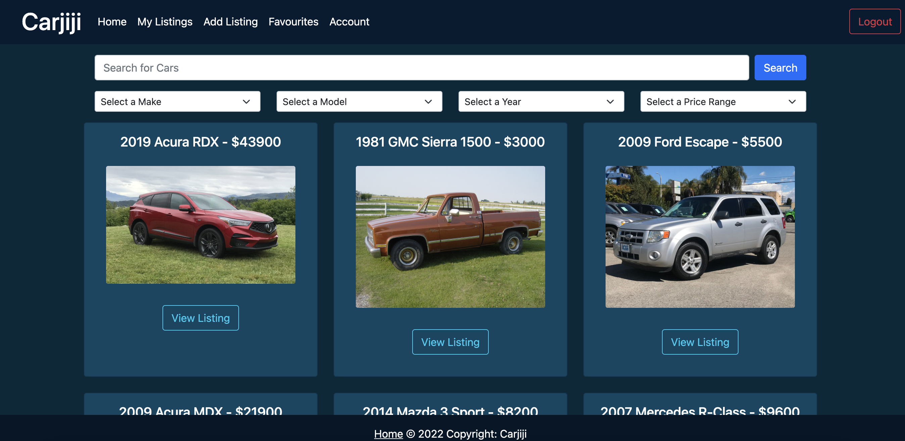
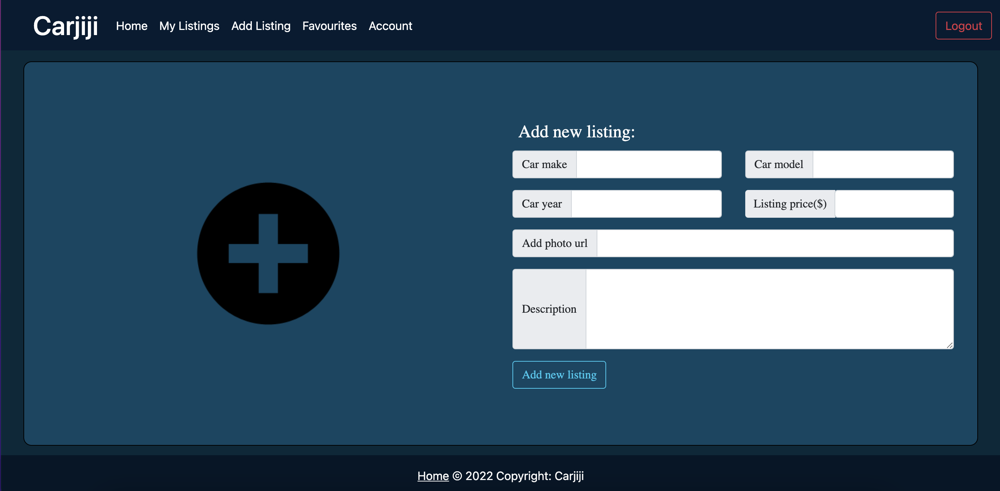

# Carjiji

An app where you can put cars for sale.

Project use NodeJS, Express,
RESTful routes for server-side.

On front-end EJS, SASS and Bootstrap for styling.

PostgreSQL and pg (with promises) for DBMS.

Git for version control.

## Final Product

## Getting Started

1. Create the `.env` by using `.env.example` as a reference: `cp .env.example .env`
2. Update the .env file with your correct local information

- username: `labber`
- password: `labber`
- database: `midterm`

3. Install dependencies: `npm i`
4. Fix to binaries for sass: `npm rebuild node-sass`
5. Reset database: `npm run db:reset`
6. Run the server: `npm run local`

7. Visit `http://localhost:8080/`

## Dependencies

- Node 10.x or above
- NPM 5.x or above
- PG 6.x
